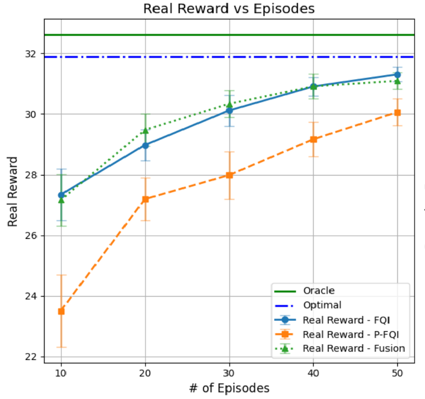
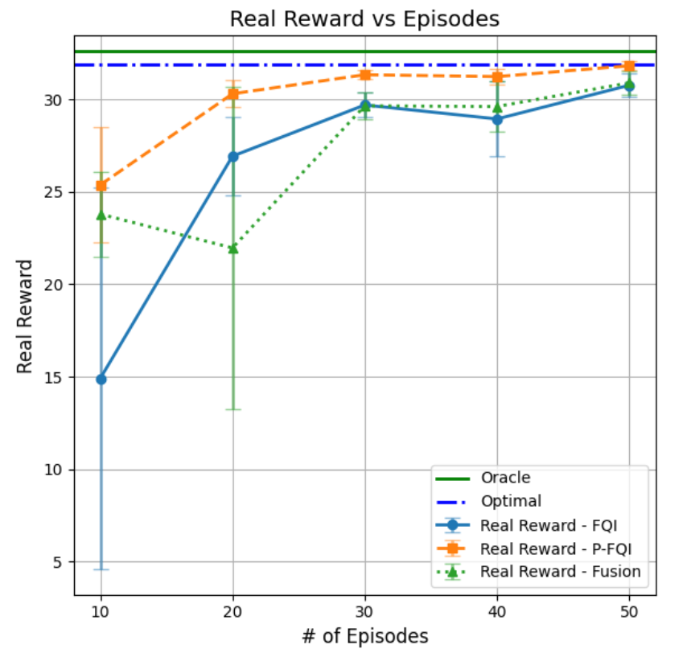

# Offline Dynamic Inventory and Pricing Strategy: Addressing Censored and Dependent Demand

## Overview

This repository contains an implementation of an offline reinforcement learning algorithm designed to solve the pricing and inventory control problem in environments characterized by censored and dependent demand. The model aims to develop a sequential feature-based pricing and ordering strategy that maximizes long-term profit. The approach integrates concepts from offline reinforcement learning and survival analysis to address the unique challenges of censoring and demand dependencies.

The project builds on a combination of novel techniques to optimize inventory and pricing policies based on historical data, tackling scenarios where demand information is incomplete due to stockouts (censored data). This repository is based on the research presented in our paper, *Offline Dynamic Inventory and Pricing Strategy: Addressing Censored and Dependent Demand*.

## Key Features

- **Multi-Stage Inventory and Pricing Optimization**: Uses a sequential decision-making approach to jointly determine pricing and ordering quantities.
- **Censored Demand Handling**: Accounts for censored demand when observed demand exceeds available inventory, leading to missing profit information.
- **Dependent Demand Consideration**: Models the dependency of current demand on past levels, reflecting real-world situations where past demand impacts future customer behavior.
- **Offline Data-Driven Learning**: Develops an optimal pricing and inventory control policy using an offline dataset of historical transitions, overcoming challenges posed by non-observable true demand.
- **Novel Algorithmic Approaches**: Implements two novel offline reinforcement learning algorithms:
  - *Censored Fitted Q-Iteration (C-FQI)*
  - *Pessimistic Censored Fitted Q-Iteration (PC-FQI)*

## Problem Background

In the context of retail and technology sectors, effective inventory and pricing decisions are crucial for profitability. However, challenges arise when true demand information is not fully observable due to censoring (e.g., stockouts). Additionally, demand often exhibits dependencies on past levels, adding complexity to the decision-making process.

To overcome these challenges, this project leverages historical data consisting of prices, ordering quantities, inventory levels, covariates, and censored sales levels to estimate optimal pricing and inventory control policies. Unlike traditional models, which often assume demand independence and perfect observability, our approach relaxes these assumptions, making it more applicable to real-world situations.

## Methodology

1. **Markov Decision Process (MDP) with Censoring**:
   - We approximate the underlying dynamic process using a high-order MDP that incorporates the number of consecutive censoring instances.
   - The challenge posed by the observed process (where censoring results in missing profit information and the failure of the Markov property) is tackled by solving a specialized Bellman equation tailored to this problem.

2. **Data-Driven Algorithms**:
   - **Censored Fitted Q-Iteration (C-FQI)**: Adapts the Fitted Q-Iteration algorithm to estimate the optimal Q-functions while accounting for demand censoring.
   - **Pessimistic C-FQI (PC-FQI)**: Further mitigates risks associated with data limitations by minimizing exploration of state-action pairs with poor coverage.

3. **Survival Analysis for Reward Imputation**:
   - To impute missing rewards due to censoring, we utilize Kaplan-Meier estimators to estimate the conditional survival functions of demand. This allows us to approximate the true rewards under censored conditions.

## Project Structure

- `env/`: Contains the environment definitions used for training and testing policies.
- `models/`: Directory for trained models.
- `algorithms/`: Implements the core algorithms, including C-FQI and PC-FQI.
- `data/`: Contains scripts for generating datasets used in the experiments.
- `tests/`: Includes unit tests for different components of the repository.
- `examples/`: Example scripts to run and evaluate trained policies.

## Getting Started

1. **Clone the Repository**:
   ```bash
   git clone https://github.com/yourusername/Pricing_Invetory_Controlv1.git
   cd Pricing_Invetory_Controlv1
   ```

2. **Install Requirements**:
   Install the required packages:
   ```bash
   pip install -r requirements.txt
   ```

3. **Run Examples**:
   To run the example script for training the model:
   ```bash
   python examples/run_example.py
   ```

4. **Testing**:
   Run unit tests to verify the implementation:
   ```bash
   python -m unittest discover tests
   ```

## Numerical Experiments

The efficacy of the proposed algorithms is validated through numerical experiments that demonstrate the performance of the estimated optimal policies under various demand conditions. Our results show that both C-FQI and PC-FQI can effectively learn pricing and inventory control policies, with PC-FQI providing robustness in scenarios with limited data coverage.

<p align="center">
  
  
</p>

<p align="center">
  <strong>(a)</strong> Results under a uniform behavior policy &nbsp;&nbsp;&nbsp;&nbsp;
  <strong>(b)</strong> Results under the optimal behavior policy
</p>

<p align="center">
  <strong>Figure:</strong> Convergence of the performances of the proposed algorithms to the optimal policy as the sample size increases: (a) Results under a uniform behavior policy; (b) Results under the optimal behavior policy. The performance of the oracle policy, $\pi^{\ast}_{\text{oracle}}$, and the optimal policy, $\pi^{\ast}$ are denoted by the green and dark blue horizontal lines, respectively. The performance of C-FQI, PC-FQI, and the fusion of these two algorithms are denoted by light blue, orange, and light green lines, respectively. The error bars represent 0.95 confidence intervals.
</p>


## Citation

If you use this repository, please cite the following paper:

```
@article{your_paper,
  title={Offline Dynamic Inventory and Pricing Strategy: Addressing Censored and Dependent Demand},
  author={Authors’ names blinded for peer review},
  journal={Management Science},
  year={2024},
  note={Manuscript MS-0001-1922.65}
}
```

## License

This repository is licensed under the MIT License. See the LICENSE file for details.

## Contact

For any questions or inquiries, please contact [Authors’ emails blinded for peer review].

